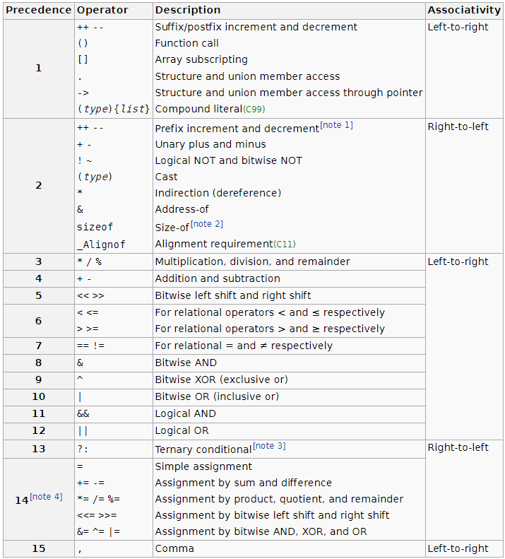

# Projet compilateur

[doc x86](doc_x86.pdf)

## Choices

Here we put the non-programming choices we made

- variables can be only constitued of letters, `_` and numbers
- for the moment we can do multiple affectations
- we choose to change the memory_offset and the tmp_index before the actions
- 
- 
- 
- 
- 

## TODO
### Mandatory

- [ ] Data type char : Bachir
- [x] Data type int
- [x] Variables
- [x] Integer constants
- [ ] Character (with single quote)
- [x] Basic arithmetic operations: +,-, *
- [x] Bit-by-bit logical operations: |, &,ˆ
- [x] Comparison operations: ==, !=, <, >.
- [x] Unary operations: ! and - and ~ (bonus)
- [x] Declaration of variables anywhere
- [ ] Assignment (which, in C, also returns a value)
- [x] Possibility of initializing a variable when declaring it
- [ ] Use of standard putchar and getchar functions for I/O: James
- [ ] Define functions with parameters, and int, char or void return type
- [ ] Check consistency of function calls and parameters (reserved names) : Gaspard & Benjamin
- [ ] Block structure using { and } : Roua & bachir
- [ ] Support for variable scopes and shadowing
- [ ] If, else, while control structures : Mathieu
- [ ] Support for return expression anywhere
- [ ] Check that a variable used in an expression has been declared
- [ ] Check that a variable is not declared more than once
- [ ] Check that a declared variable is used at least once

### Optional

- [ ] Division and modulo (in IR): Bachir
- [ ] Assignment operators +=, -= etc., increment ++ and decrement - - - [ ] Arrays (one-dimensional): Bachir
- [ ] Arrays (one-dimensional)
- [ ] Pointers
- [ ] Break and continue
- [ ] Strings re

## Ressources

- see example of [c.g4](https://github.com/antlr/grammars-v4/blob/master/c/C.g4)
- 
- 

